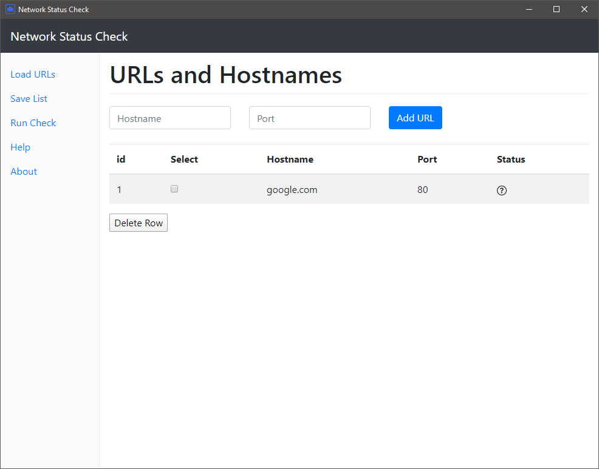
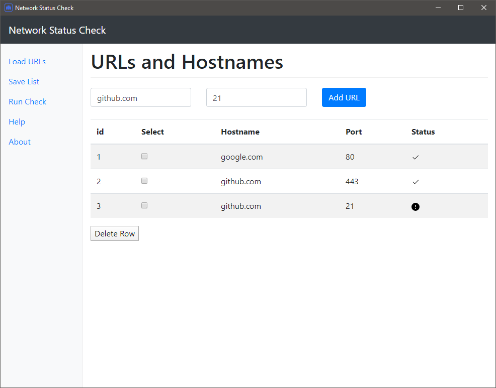

# Network Status Check application written with Electron, Bootstrap, jQuery

This is a tool to add URLs and ports to check to see if they are open or not. You can add as many items to the list, and edit the list as well if needed. You can save your list and eventually reimport the list as well on launch or by using the Load URLs button.

Main Window



Run Check



## Quick Code Tour

- The code entry point is in **package.json** under the key "main". The value is "main.js"
- **main.js** creates a BrowserWindow and loads **index.html**. It also has event handlers that enable keyboard shortcuts for Developer Tools on various platforms. Note that loadURL uses a [template literal](https://developer.mozilla.org/en-US/docs/Web/JavaScript/Reference/Template_literals) to give the source file's location.`` `file://${__dirname}/app/index.html` ``
- **index.html** loads Bootstrap's CSS in the &lt;head&gt; tag and **renderer.js** after the closing &lt;body&gt; tag. On the web Bootstrap's JavaScript would also load in this location but the Electron way is to load it in **renderer.js** with a require(). Note that these src and href attributes use normal relative paths. An HTTP server is not necessary.
- **renderer.js** loads jQuery, Bootstrap and it's dependency; Tether. Each is assigned to the window object because this is the web application custom. It's not the Node.js or Electron custom because window is a global. For now we must do it this way or it won't work.
- **setup.js** setups up some overall settings for the application
- **app.js** is the real worker of functions.

## Releases

At this time the releases are for Windows as that is my main developing platform and where I use this tool mostly; on Windows environments.

[View Releases](https://github.com/cjerrington/net-check/releases/latest)

## Running Application

First download and install dependencies, then start the app.

```bash
git clone https://github.com/cjerrington/net-check.git
cd net-check
npm install
npm start
```

## Creating Releases

Electron Forge allows us to make builds based on our operating system we are running from. Linux (Debian) and Windows 10 tested.

```bash
npm run make
```

You can check websites like google.com, github.com, or any URL you need and the port. It is best to use the FQDN for local addresses or use the hostnames IP instead.

Please let me know if you have any issues or questions. If you have a suggestion for approval create an issue or a pull request.
